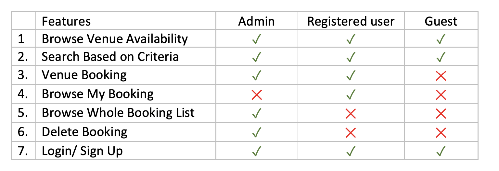
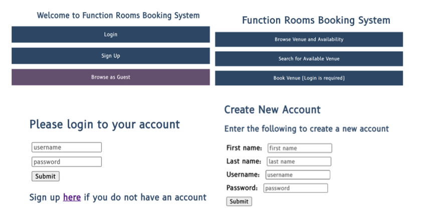
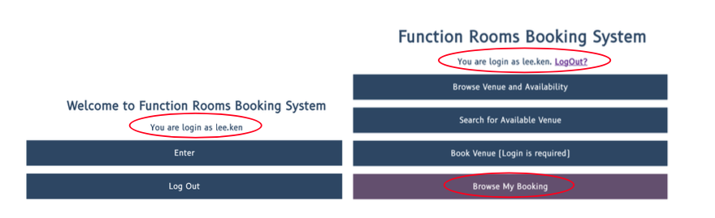
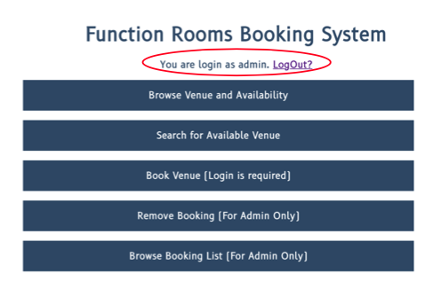
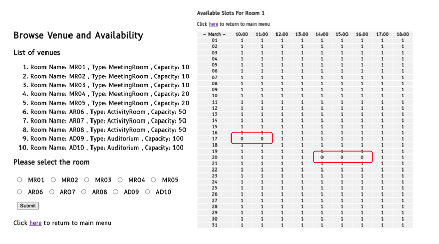
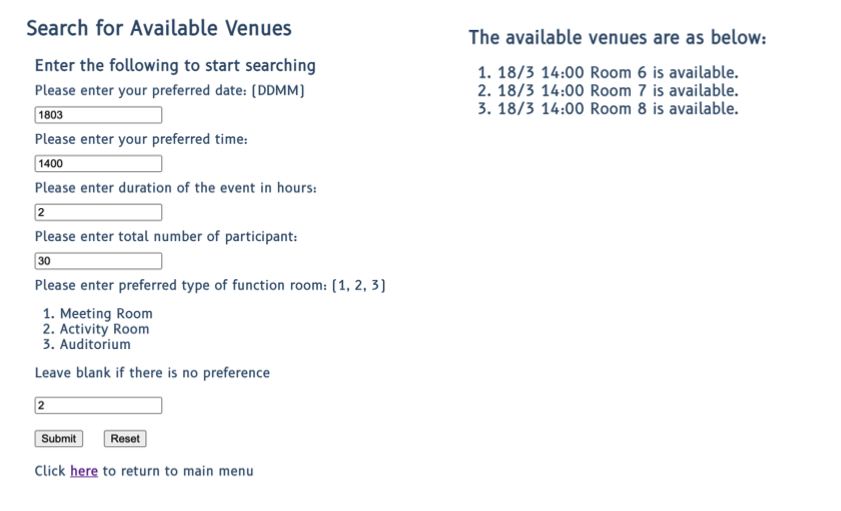
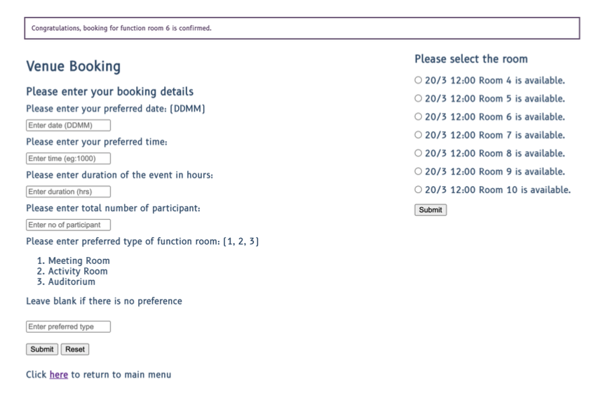
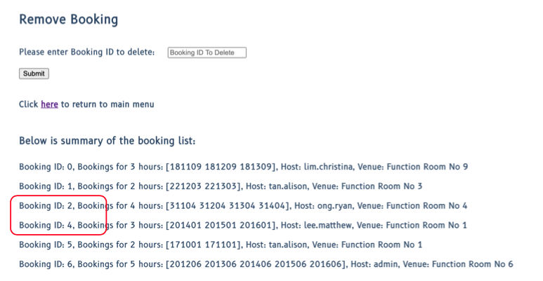
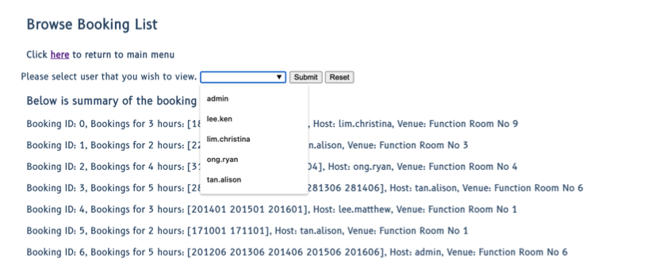
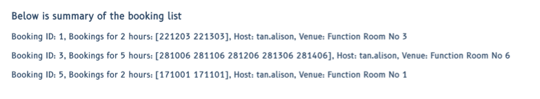

# FunctionRoomsBookingSystem
Second project built using entirely using Go. 

An application that incorporates data structures and algorithms, network programming, and basic security features.

Go School - Module 2 (Go Advanced) Assignment

# Version

|  Version   |                        Changes                          |
| ---------- | :-----------------------------------------------------: |
|    1.0     |    Initial Commit with basic console application.       |
|    2.0     |    Update to Server-Client Application.                 |
|    3.0     |    Update with security features and go documentation.  |

# V1.0
1. Setup different data structures such as linked list, struct, array bases list, etc for this application.
2. Incorporate search and sorting algorithms in the application such as binary search, selection sort etc.
3. Incorporate concurrency for searching algorithms to ensure searching for different function rooms can be done concurrrently.
4. Code defensively to include error handling and panic handling in the code.

# V2.0
1. Setup of HTTP connection 
2. Setup web browser for the application using templates
3. Modify the source code to be ensure it can handle concurrency - different request from multiple clients.

# V3.0
## Security Features
1. Input Validation
2. Sanitization of Input to prevent XSS
3. Setup HTTPS, generate Open SSL cert
4. Proper Error Handling 
5. Logging for errors, panic, fatal and important events
6. Checksum for logging (SHA-256)
7. Password Hashing (Brycpt)
8. Generate cookie (UUID), expiry time, prevent multi-login

## Idiomatic Go and Go Documentations
Refer to V3.0/goDocumentation for documentations of different packages

# Features
1. All the features that have been setup for this application are as below. 

2. Pages that will be seen by guest of the application (No login required.)

3. Once login, registered user can access to more features than guest access.

4. Admin will be able to view the whole booking list and delete booking by booking ID.

5. Below is display of different features:
    a)
    
    
    
    b)
    
    
    
    c)
    
    
    
    d)
    
    
    
    e)
    
    
    
    f)
    
    

